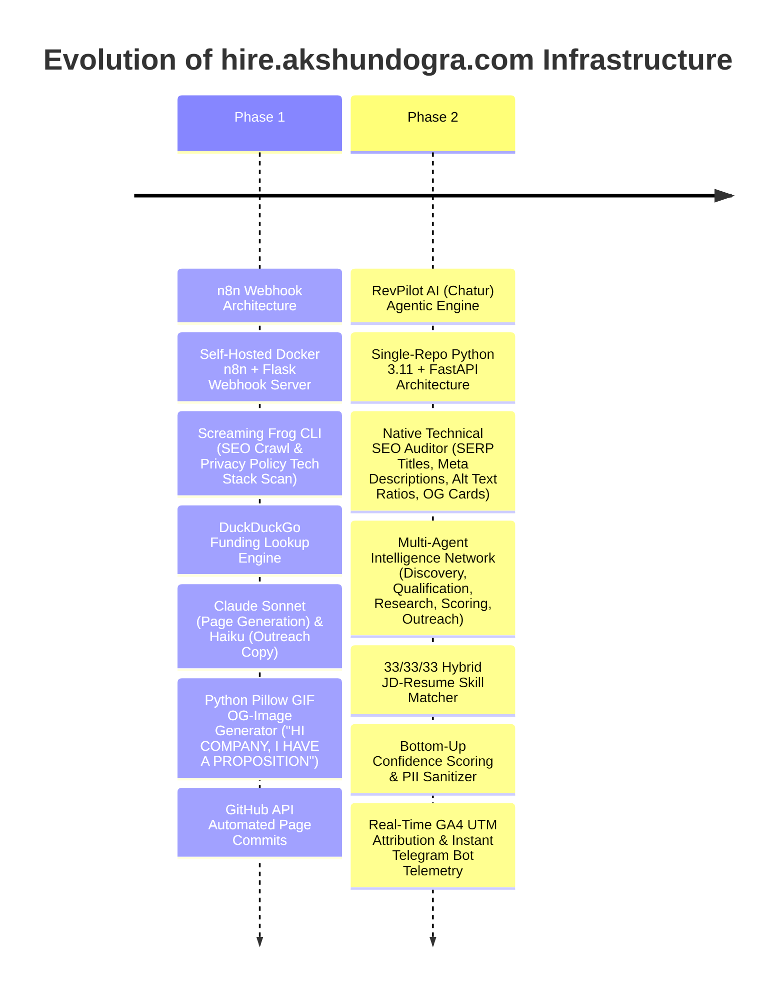
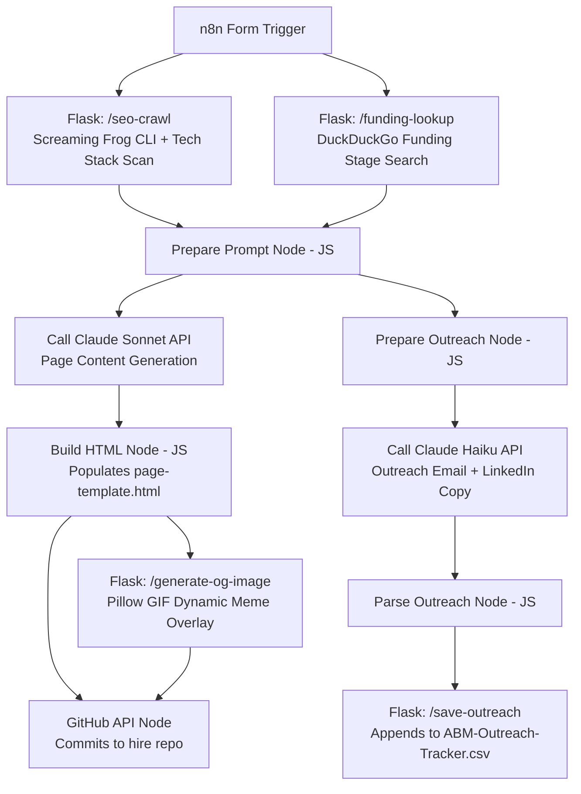
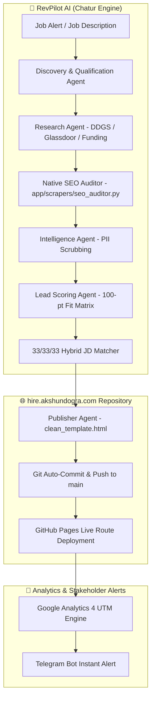
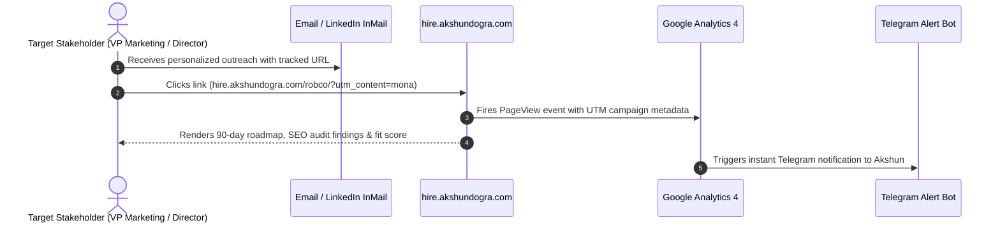

# 🚀 hire.akshundogra.com — Autonomous ABM & GTM Engine Host

[-blueviolet?style=for-the-badge)](https://github.com/akshundogra/Chatur)

**`hire.akshundogra.com`** is the live deployment domain for **Akshun Dogra's** automated Account-Based Marketing (ABM) and GTM Engineering systems. 

Instead of submitting standard PDF resumes to Applicant Tracking Systems (ATS), this platform automatically crawls target companies, analyzes their marketing/tech stack, audits their SEO/funding signals, and generates bespoke, interactive 90-day execution landing pages with personalized outreach copy.

---

## 🔄 System Evolution: Phase 1 (n8n + Flask) vs. Phase 2 (RevPilot AI)

---

## 🏗️ Architecture & Component Diagrams

### 1. Phase 1: n8n + Flask + Screaming Frog Workflow Architecture

---

### 2. Phase 2: RevPilot AI (Chatur) Agentic Architecture

---

### 3. End-to-End Stakeholder Engagement & Telemetry Sequence

---

## 🛠️ Stack & Component Reference

### Phase 1: Microservice Engine (`n8n-files`)
* **`n8n` (Docker)**: Workflow orchestration & form webhook processing.
* **`webhook_server.py`**: Flask master server hosting API routes.
* **`seo_crawler_route.py` (`/seo-crawl`)**: Executes Screaming Frog CLI for SEO data (missing alt text, title lengths) and scans privacy policies for tracking tags (`HubSpot`, `Salesforce`, `LinkedIn Ads`, `GA4`).
* **`funding_lookup_route.py` (`/funding-lookup`)**: Queries DuckDuckGo HTML search for funding stage (Seed vs Series A vs Series B+) to calibrate prompt tone.
* **`og_image_route.py` (`/generate-og-image`)**: Uses Python Pillow to dynamically overlay target company names onto custom hero GIFs (`"HI [COMPANY], I HAVE A PROPOSITION"`).
* **`outreach_tracker_route.py` (`/save-outreach`)**: Appends generated email subjects, bodies, and LinkedIn connection notes to local `ABM-Outreach-Tracker.csv`.

### Phase 2: Agentic Engine ([Chatur / RevPilot AI](https://github.com/akshundogra/Chatur))
* **FastAPI Orchestrator**: Async single-repo engine running 8 specialized AI sub-agents.
* **`app/scrapers/seo_auditor.py`**: Native Technical SEO & GTM Stack Auditor:
  * **Title Tag SERP Bounds**: Detects missing titles, titles <30 chars, or SERP truncations (>60 chars).
  * **Meta Description Inspection**: Validates presence and SERP snippet length (70–160 chars).
  * **Heading Hierarchy**: Identifies missing H1s or duplicate H1 tag conflicts.
  * **Image Alt Text Ratios**: Calculates exact ratio of images missing `alt` text.
  * **Open Graph / Social Preview Cards**: Checks for missing `og:image` or `og:title` metadata.
  * **Tech Stack Fingerprinting**: Detects `HubSpot`, `Salesforce`, `GA4`, `PostHog`, `Segment`, `Intercom`, `Drift`.
* **`app/gtm_pipeline/email_finder.py`**: Multi-key Hunter.io API pool with live SMTP email verification.
* **`app/gtm_pipeline/telegram.py`**: Role-title regex sanitizer (`clean_role_title`) & Telegram bot dispatcher.
* **`app/utils/confidence.py`**: Bottom-up evidence, signal, and lead score confidence algorithms.

---

## 📂 Active Live Routes

Below is an index of company landing pages deployed on this host:

| Target Company | Open Role | Route | Infrastructure |
| :--- | :--- | :--- | :--- |
| **RobCo** | Marketing Operations Specialist | [`hire.akshundogra.com/robco/`](https://hire.akshundogra.com/robco/) | 🟢 RevPilot AI (Fit: 100/100) |
| **Alasco** | Revenue Operations & Growth Manager | [`hire.akshundogra.com/alasco/`](https://hire.akshundogra.com/alasco/) | 🟢 RevPilot AI |
| **Eye-Able** | GTM & Growth Lead | [`hire.akshundogra.com/eye-able/`](https://hire.akshundogra.com/eye-able/) | 🟢 RevPilot AI |
| **Celonis** | Enterprise Growth Specialist | [`hire.akshundogra.com/celonis/`](https://hire.akshundogra.com/celonis/) | 🟢 n8n + Flask |
| **Vercel** | Developer Experience Lead | [`hire.akshundogra.com/vercel/`](https://hire.akshundogra.com/vercel/) | 🟢 n8n + Flask |
| **PostHog** | Growth & Analytics Engineer | [`hire.akshundogra.com/posthog/`](https://hire.akshundogra.com/posthog/) | 🟢 n8n + Flask |

---

> [!NOTE]
> All landing pages on `hire.akshundogra.com` are created dynamically as proof-of-work GTM engineering demonstrations for targeted company applications.
