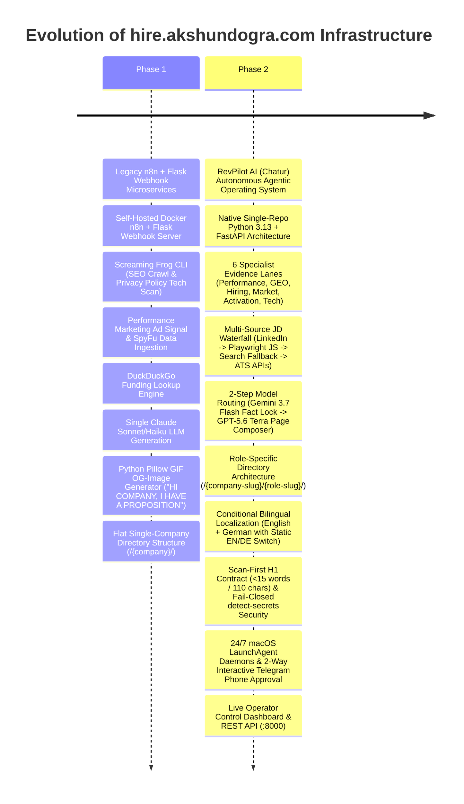
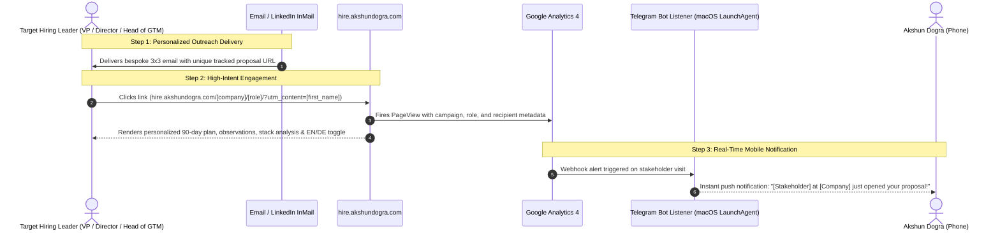

# 🚀 hire.akshundogra.com — Autonomous ABM & GTM Engine Host

[](https://hire.akshundogra.com)
[_v2.0-blueviolet?style=for-the-badge)](https://github.com/akshundogra/Chatur)
[](https://hire.akshundogra.com)
[](https://hire.akshundogra.com)
[](https://github.com/akshundogra/Chatur)
[](https://hire.akshundogra.com)

**`hire.akshundogra.com`** is the live production deployment host for **Akshun Dogra's** autonomous Account-Based Marketing (ABM) and Go-To-Market (GTM) Engineering platform.

Instead of submitting static PDF resumes to Applicant Tracking Systems (ATS), this platform autonomously detects target job opportunities, crawls company digital footprints, analyzes MarTech & data instrumentation, audits performance marketing channels & technical SEO/GEO signals, and generates bespoke 90-day execution landing pages with personalized, high-conversion outreach copy.

---

## 🔄 System Evolution: Phase 1 (Legacy) vs. Phase 2 (RevPilot AI Agentic OS)



---

## 🏛️ Specialist Evidence Lanes & Knowledge Graph

Every personalized landing page and proposal is generated from a validated, sanitized **Knowledge Graph** across six specialist evidence lanes:

| Evidence Lane | Analyzed Data Points & Signal Extraction | Impact on Outreach & Strategic Proposal |
| :--- | :--- | :--- |
| 📈 **1. Paid / Performance** | • Active vs Unobserved Ad Channels (`Google Ads`, `Meta Ads`, `LinkedIn Ads`, `TikTok Ads`)<br>• GTM Tag IDs (`gtm-[a-z0-9]+`) & Google Ads Conversion IDs (`AW-\d+`)<br>• Demand Capture vs. Demand Generation channel gap analysis | Identifies missing high-intent ad channels & highlights immediate paid growth quick-wins |
| 🔍 **2. GEO & AI-Crawler Readiness** | • AI Crawler Policies in `robots.txt` (`GPTBot`, `ClaudeBot`, `PerplexityBot`, `CCBot`)<br>• `llms.txt` presence & structured markdown documentation for LLMs<br>• Schema.org JSON-LD structured data (`Organization`, `SoftwareApplication`, `FAQPage`)<br>• SERP title/meta truncation, heading hierarchy, & `hreflang` internationalization | Outlines Generative Engine Optimization (GEO) & AI answer-readiness strategy |
| 👥 **3. Hiring & Organization** | • Active ATS role evidence (`Greenhouse`, `Lever`, `Personio`, `Workday`, `Join.com`, `Homerun`)<br>• Role scope quantifier (responsibilities, requirements, team remit)<br>• Public GTM team composition & reporting structures | Tailors proposals directly to the hiring manager's mandate and KPIs |
| 📰 **4. Momentum & Market** | • Verified funding rounds and investor syndicates (Seed, Series A, Series B+)<br>• Recent product launches, category expansions, and press releases<br>• Verified customer review signals and G2/Capterra positioning | Calibrates business-maturity tone and commercial urgency |
| 🧭 **5. Product Journey & Activation** | • First-party onboarding flows, self-service entry points, and product signup journeys<br>• Time-to-value friction points and product activation milestones<br>• Cross-functional alignment (Product, Marketing, Sales, RevOps) | Designs a bespoke 30-60-90 day product-led growth (PLG) and sales-assist roadmap |
| 🛠️ **6. Tech Stack & Instrumentation** | • CMS (`Webflow`, `WordPress`, `Next.js`, `Vercel`, `Shopify`)<br>• Analytics & Data (`GA4`, `PostHog`, `Mixpanel`, `Segment`, `Plausible`, `Hotjar`)<br>• Marketing Automation & CRM (`HubSpot`, `Salesforce`, `Marketo`, `Intercom`, `Drift`)<br>• Declared vendors, observed scripts, and privacy-safe cookie identifiers | Proves immediate hands-on tooling familiarity on day one |

---

## 🏗️ Architecture & Component Diagrams

### 1. End-to-End RevPilot AI Multi-Agent Pipeline

```mermaid
flowchart TD
    subgraph Discovery ["📥 Discovery & Inbound Waterfall"]
        A1[Gmail Job Alert Listener / LinkedIn Digest] --> A2{Deduplication & ICP Exclusion Guard}
        A2 -->|Pass| A3[Multi-Source JD Enrichment Waterfall]
        A3 -->|Order: LinkedIn -> JS Render -> Public Search -> ATS API| A4[Sanitized Job Description & Role Lock]
    end

    subgraph Intelligence ["🧠 Signal Intelligence & Fact Selection"]
        A4 --> B1[Specialist Evidence Collectors\nAds, SEO/GEO, Tech, Hiring, Market]
        B1 --> B2[Sanitized Knowledge Graph]
        B2 --> B3[Scoring Engine: Fit Score 0-100 & Tiering]
        B3 --> B4[Gemini 3.7 Flash High:\nFact Selection + 4 Role Observations]
        B4 --> B5[Python Ground-Truth Resolution & Observation Lock]
    end

    subgraph Generation ["⚡ Page Decision & Localization"]
        B5 --> C1[Codex CLI: GPT-5.6 Terra High\nOne Page-Composition Call]
        C1 --> C2{Deterministic Quality Gates\nScan-First H1, Phased Plan, Hygiene}
        C2 -->|Fail| C3[One Bounded Targeted Repair]
        C3 --> C2
        C2 -->|Pass| C4{Predominantly German JD?}
        C4 -->|Yes| C5[Gemini Translation:\nTranslates Approved Page Fields]
        C4 -->|No (English)| C6[English Page Ready]
        C5 --> C7[Bilingual EN + DE Static Pages]
    end

    subgraph Security ["🔒 Security & Publication"]
        C6 --> D1[Fail-Closed detect-secrets & Git Remote Scan]
        C7 --> D1
        D1 -->|Pass| D2[Publisher Agent:\nAtomic Git Commit to hire.akshundogra.com]
        D2 --> D3[Deploy to GitHub Pages\n/{company}/{role}/ and /{company}/{role}/de/]
    end

    subgraph Telemetry ["📡 Real-Time Telemetry & Phone Approval"]
        D3 --> E1[Google Analytics 4 UTM Tracking]
        E1 --> E2[Telegram Bot Alert to Akshun]
        D3 --> E3[Operator Control Dashboard\nhttp://localhost:8000/dashboard]
    end
```

---

### 2. Stakeholder Engagement & Real-Time Telemetry Sequence



---

## 🛠️ Stack & Component Reference

### RevPilot AI Engine Core ([Chatur Repository](https://github.com/akshundogra/Chatur))

* **`app/main.py`**: CLI entry point and FastAPI REST application server (`:8000`).
* **`app/dashboard/`**: Interactive Operator Control Dashboard for real-time lead tracking, artifact preview, and outreach checklist management.
* **`app/gtm_pipeline/research.py`**: Deterministic specialist collector for MarTech scripts, ad tags (`Google Ads`, `Meta Ads`, `LinkedIn Ads`), cookie identifiers, and technical SEO/GEO signals.
* **`app/gtm_pipeline/research_synthesis.py`**: Uses **Gemini 3.7 Flash High** via Google Antigravity to select verified fact IDs and produce 4 structured, role-specific observations.
* **`app/gtm_pipeline/observation_strategy.py`**: Pure Python validator that locks Gemini's observations against ground-truth facts and rejects hallucinated numbers or unverified source keys.
* **`app/gtm_pipeline/codex_runtime.py` & `generate.py`**: Uses **GPT-5.6 Terra High** via Codex CLI to compose the complete landing page in a single call.
* **`app/gtm_pipeline/localization.py`**: Deterministic German JD language detector and schema-constrained Gemini translator. Renders static English and German pages with an interactive EN/DE switcher, language-specific OpenGraph tags, and `hreflang` alternate links.
* **`app/gtm_pipeline/publish.py`**: Publisher agent that writes role-specific directory structures (`/{company-slug}/{role-slug}/`), updates root `index.html` card grids, and generates `sitemap.xml`.
* **`app/utils/secrets_guard.py`**: Fail-closed security guard running `detect-secrets` and credential pattern matchers before any git staging or pushing.
* **`app/gtm_pipeline/telegram_bot_listener.py`**: 2-way interactive Telegram bot supporting `/company` (enrichment + 3x3 draft), `/sent` (verified Gmail SMTP dispatch), and `/publish` (medium-fit approval).
* **`app/gtm_pipeline/email_listener.py`**: Continuous Gmail alert poller with mailbox UID floor checkpointing and multi-card LinkedIn digest processing.
* **`launchd/`**: Committed macOS LaunchAgent definitions for 24/7 background operation:
  - `com.akshun.revpilot.server.plist` (Dashboard & API)
  - `com.akshun.revpilot.telegram.plist` (Telegram Bot)
  - `com.akshun.revpilot.email.plist` (Gmail Monitor)

---

## 📂 Representative Live Published Routes

The active route inventory is dynamically updated with each live publication; browse the homepage or [`sitemap.xml`](https://hire.akshundogra.com/sitemap.xml) for the full index. Below is a representative selection:

| Target Company | Target Role | Live Published Route | Languages | Engine Version |
| :--- | :--- | :--- | :--- | :--- |
| **Apaleo** | GTM Operations Specialist | [`/apaleo/gtm-operations-specialist-f-m-d/`](https://hire.akshundogra.com/apaleo/gtm-operations-specialist-f-m-d/) | 🇬🇧 English | 🟢 RevPilot v2.0 |
| **Angi** | Performance Marketing Manager (Paid Search) | [`/angi/`](https://hire.akshundogra.com/angi/) | 🇬🇧 English | 🟢 RevPilot v2.0 |
| **FTAPI** | (Junior) AI Go-to-Market Engineer | [`/ftapi/ai-go-to-market-engineer/`](https://hire.akshundogra.com/ftapi/ai-go-to-market-engineer/) | 🇬🇧 English · 🇩🇪 Deutsch | 🟢 RevPilot v2.0 |
| **Trading 212** | Growth Marketing Lead | [`/trading-212/`](https://hire.akshundogra.com/trading-212/) | 🇬🇧 English · 🇩🇪 Deutsch | 🟢 RevPilot v2.0 |
| **Flowers-Software** | Marketing Operations Manager | [`/flowers-software/`](https://hire.akshundogra.com/flowers-software/) | 🇬🇧 English · 🇩🇪 Deutsch | 🟢 RevPilot v2.0 |
| **Actindo** | Senior B2B SaaS Marketing Manager | [`/actindo/`](https://hire.akshundogra.com/actindo/) | 🇬🇧 English · 🇩🇪 Deutsch | 🟢 RevPilot v2.0 |
| **RobCo** | Marketing Operations Specialist | [`/robco/`](https://hire.akshundogra.com/robco/) | 🇬🇧 English | 🟢 RevPilot v2.0 |
| **Chaos** | Growth Automation Manager | [`/chaos/`](https://hire.akshundogra.com/chaos/) | 🇬🇧 English | 🟢 RevPilot v2.0 |
| **Canva** | Creative Strategist, Growth Marketing | [`/canva/`](https://hire.akshundogra.com/canva/) | 🇬🇧 English | 🟢 RevPilot v2.0 |
| **Storyblok** | Salesforce Lead | [`/storyblok/`](https://hire.akshundogra.com/storyblok/) | 🇬🇧 English | 🟢 RevPilot v2.0 |
| **Personio** | Sr. Business Automation Specialist | [`/personio/`](https://hire.akshundogra.com/personio/) | 🇬🇧 English | 🟢 RevPilot v2.0 |
| **Leapsome** | Head of Growth Marketing & Lifecycle | [`/leapsome/`](https://hire.akshundogra.com/leapsome/) | 🇬🇧 English | 🟢 RevPilot v2.0 |
| **Contentful** | GTM Engineer | [`/contentful/`](https://hire.akshundogra.com/contentful/) | 🇬🇧 English | 🟢 RevPilot v2.0 |
| **Alasco** | GTM Engineer | [`/alasco/`](https://hire.akshundogra.com/alasco/) | 🇬🇧 English | 🟢 RevPilot v2.0 |
| **Eye-Able** | GTM Engineer | [`/eye-able/`](https://hire.akshundogra.com/eye-able/) | 🇬🇧 English | 🟢 RevPilot v2.0 |
| **Gigs** | Go To Market Lead, Germany | [`/gigs/`](https://hire.akshundogra.com/gigs/) | 🇬🇧 English | 🟢 RevPilot v2.0 |

> Full searchable route catalog available at [`hire.akshundogra.com`](https://hire.akshundogra.com) and in [`sitemap.xml`](https://hire.akshundogra.com/sitemap.xml).

---

## 🔒 Governance, Disclaimers & Compliance

> [!NOTE]
> All landing pages hosted on `hire.akshundogra.com` are independent, non-commercial proof-of-work GTM engineering demonstrations for targeted career applications; they are not affiliated with, sponsored by, or endorsed by the named companies. Pages are published only after active-job verification, fit scoring (≥80/100), deterministic quality gates, and automated security scans pass.
>
> Excluded roles (Solutions Engineering, Customer Success, Product Marketing, Business Development) and excluded companies are blocked before research and again at every publication boundary. All scraped data is sanitized to redact personal contact info and proprietary secrets prior to storage.

