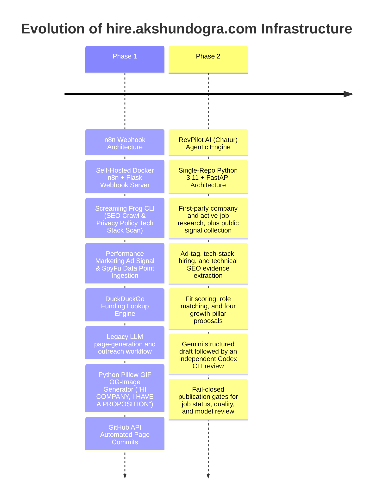
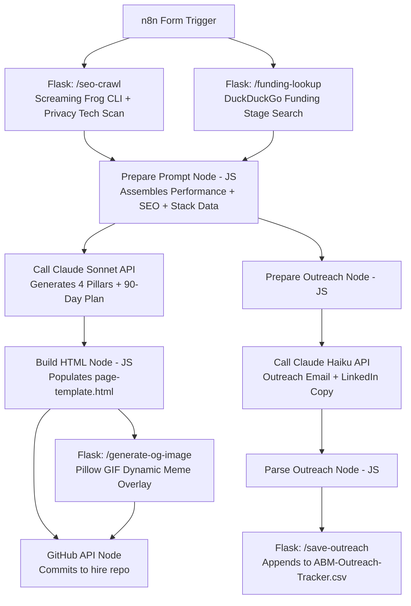
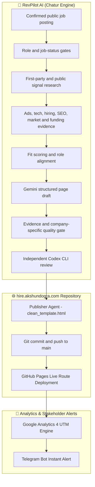
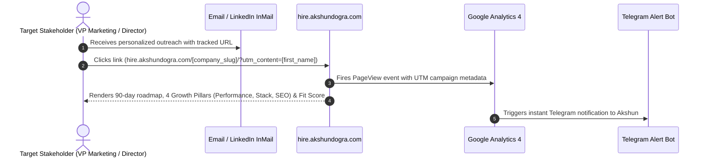

# 🚀 hire.akshundogra.com — Autonomous ABM & GTM Engine Host

[-blueviolet?style=for-the-badge)](https://github.com/akshundogra/Chatur)

**`hire.akshundogra.com`** is the live deployment domain for **Akshun Dogra's** automated Account-Based Marketing (ABM) and GTM Engineering systems. 

Instead of submitting standard PDF resumes to Applicant Tracking Systems (ATS), this platform automatically crawls target companies, analyzes their marketing/tech stack, audits their performance marketing ad signals & SEO data points, and generates bespoke 90-day execution landing pages with personalized outreach copy.

---

## 🔄 System Evolution: Phase 1 (n8n + Flask) vs. Phase 2 (RevPilot AI)

---

## 🏛️ The 4 Core Growth Audit Pillars

Every personalized landing page and proposal generated by this platform audits target companies across **4 core growth pillars**:

| Growth Pillar | Analyzed Data Points & Signal Extraction | Impact on Outreach & Proposal |
| :--- | :--- | :--- |
| ⚡ **1. Performance Marketing** | • Active vs Untapped Ad Channels (`Google Ads`, `Meta Ads`, `LinkedIn Ads`, `TikTok Ads`) • GTM Tag IDs (`gtm-[a-z0-9]+`) & Google Ads Conversion IDs (`AW-\d+`) • SpyFu performance datasets (paid search keywords, budget estimates, ad copies) • Demand Capture vs. Demand Generation channel gap analysis | Identifies missing high-intent ad channels & highlights immediate paid growth quick-wins |
| 🤖 **2. Automation & RevOps** | • Inbound Lead Routing & CRM Stack (`HubSpot`, `Salesforce`, `Marketo`, `Drift`) • Form submission response loops & lead scoring maturity • Automated data enrichment & webhook pipeline readiness | Proposes 90-day RevOps automation architecture & lead routing fixes |
| 🔍 **3. Technical SEO & GEO** | • SERP Title Length (<30 or >60 chars SERP truncation) • Meta Description presence & snippet length bounds (70–160 chars) • H1 Heading hierarchy & missing alt text ratios (`7/77 images missing alt text`) • Schema.org structured data & OpenGraph social card verification | Outlines technical SEO fixes & Generative Engine Optimization (GEO) strategy |
| 🛠️ **4. Tech Stack & Infra** | • CMS (`Webflow`, `WordPress`, `Next.js`, `Vercel`) • Product Analytics (`GA4`, `PostHog`, `Mixpanel`, `Plausible`, `Hotjar`) • Product Widgets (`Intercom`, `Stripe`, `Segment`) | Demonstrates immediate stack familiarity before walking in the door |

---

## 🏗️ Architecture & Component Diagrams

### 1. Phase 1: n8n + Flask + Screaming Frog Workflow Architecture

---

### 2. Phase 2: RevPilot AI (Chatur) Agentic Architecture

---

### 3. End-to-End Stakeholder Engagement & Telemetry Sequence

---

## 🛠️ Stack & Component Reference

### Phase 1: Microservice Engine (`n8n-files`)
* **`n8n` (Docker)**: Workflow orchestration & form webhook processing.
* **`webhook_server.py`**: Flask master server hosting API routes.
* **`seo_crawler_route.py` (`/seo-crawl`)**: Executes Screaming Frog CLI for SEO data (missing alt text, title lengths) and scans privacy policies for tracking tags (`HubSpot`, `Salesforce`, `LinkedIn Ads`, `GA4`).
* **`funding_lookup_route.py` (`/funding-lookup`)**: Queries DuckDuckGo HTML search for funding stage (Seed vs Series A vs Series B+) to calibrate prompt tone.
* **`og_image_route.py` (`/generate-og-image`)**: Uses Python Pillow to dynamically overlay target company names onto custom hero GIFs (`"HI [COMPANY], I HAVE A PROPOSITION"`).
* **`outreach_tracker_route.py` (`/save-outreach`)**: Appends generated email subjects, bodies, and LinkedIn connection notes to local `ABM-Outreach-Tracker.csv`.

### Phase 2: Agentic Engine ([Chatur / RevPilot AI](https://github.com/akshundogra/Chatur))
* **Evidence-grounded orchestration**: A single-repo Python engine researches the public job posting and target company's first-party homepage before it generates a proposal. Scraped content is sanitized before use.
* **`app/gtm_pipeline/research.py` (`fetch_ad_signals`)**: Performance Marketing Ad Signal Engine scans public page markup for `Google Ads` (AW- tags), `Meta Ads` (fbq), `LinkedIn Ads` (snap.licdn.com), and `Google Tag Manager` (gtm- IDs), then identifies active versus unobserved channels.
* **`app/scrapers/tech_fingerprinter.py`**: Tech Stack Fingerprinting Matrix:
  * **CMS**: `Webflow`, `WordPress`, `Next.js`
  * **Analytics & Product**: `GA4`, `PostHog`, `Mixpanel`, `Plausible`, `Hotjar`
  * **CRM & Marketing Ops**: `HubSpot`, `Salesforce`, `Marketo`, `Drift`, `Intercom`
  * **Infrastructure**: `Vercel`, `Stripe`, `Segment`
* **`app/scrapers/seo_auditor.py`**: Native Technical SEO & GTM Stack Auditor.
* **`app/gtm_pipeline/generate.py`**: Requires a complete structured draft and rejects boilerplate, unsupported tools, thin company theses, repeated sections, and copy not grounded in first-party company language.
* **`app/gtm_pipeline/model_review.py`**: Uses the locally authenticated Codex CLI in an ephemeral read-only sandbox to independently approve or reject the Gemini draft. A missing, failed, or rejected review pauses the run; it never becomes a single-model publish.
* **`app/gtm_pipeline/tier_router.py`**: Requires a positively confirmed active public job posting, a `HIGH_FIT` score, a passed evidence/quality gate, and an approved independent review before live publication. Quota failures and incomplete drafts also pause rather than publishing fallback copy.
* **`app/utils/exclusion.py`**: Single source of truth for ICP exclusion keywords (including Solutions Engineering, Customer Success, Product Marketing, Business Development, and Sales Enablement). Enforced at four layers:
  1. `tier_router.py` — Hard gate before any research/scoring
  2. `generate_page.py` — CLI entry point check
  3. `score.py` — Sets `LOW_FIT` / `auto_publish=False`
  4. `publish.py` — Final publish block
* **Funding accuracy**: Specific funding stages are used only when the company and round can be verified from public evidence; otherwise the proposal stays deliberately non-specific.

---

## 📂 Active Live Routes

The current route inventory is generated with each live publication; browse the homepage or [`sitemap.xml`](https://hire.akshundogra.com/sitemap.xml) for the authoritative list. Below is a representative sample:

| Target Company | Open Role | Route | Infrastructure |
| :--- | :--- | :--- | :--- |
| **RobCo** | Marketing Operations Specialist | [`/robco/`](https://hire.akshundogra.com/robco/) | 🟢 RevPilot AI |
| **Chaos** | Growth Automation Manager | [`/chaos/`](https://hire.akshundogra.com/chaos/) | 🟢 RevPilot AI |
| **Canva** | Creative Strategist, Growth Marketing | [`/canva/`](https://hire.akshundogra.com/canva/) | 🟢 RevPilot AI |
| **Storyblok** | Salesforce Lead | [`/storyblok/`](https://hire.akshundogra.com/storyblok/) | 🟢 RevPilot AI |
| **Personio** | Sr. Business Automation Specialist | [`/personio/`](https://hire.akshundogra.com/personio/) | 🟢 RevPilot AI |
| **Leapsome** | Head of Growth Marketing & Lifecycle | [`/leapsome/`](https://hire.akshundogra.com/leapsome/) | 🟢 RevPilot AI |
| **Contentful** | GTM Engineer | [`/contentful/`](https://hire.akshundogra.com/contentful/) | 🟢 RevPilot AI |
| **Alasco** | GTM Engineer | [`/alasco/`](https://hire.akshundogra.com/alasco/) | 🟢 RevPilot AI |
| **Eye-Able** | GTM Engineer | [`/eye-able/`](https://hire.akshundogra.com/eye-able/) | 🟢 RevPilot AI |
| **Gigs** | Go To Market Lead, Germany | [`/gigs/`](https://hire.akshundogra.com/gigs/) | 🟢 RevPilot AI |

> Full route index available at [`hire.akshundogra.com`](https://hire.akshundogra.com) and in [`sitemap.xml`](https://hire.akshundogra.com/sitemap.xml).

---

> [!NOTE]
> All landing pages on `hire.akshundogra.com` are independent proof-of-work GTM engineering demonstrations for targeted company applications; they are not affiliated with, sponsored by, or endorsed by the named company. Pages are only published after active-job, fit, evidence, quality, and independent-model-review gates pass. Excluded roles and companies are blocked before research and again at every publication boundary.
