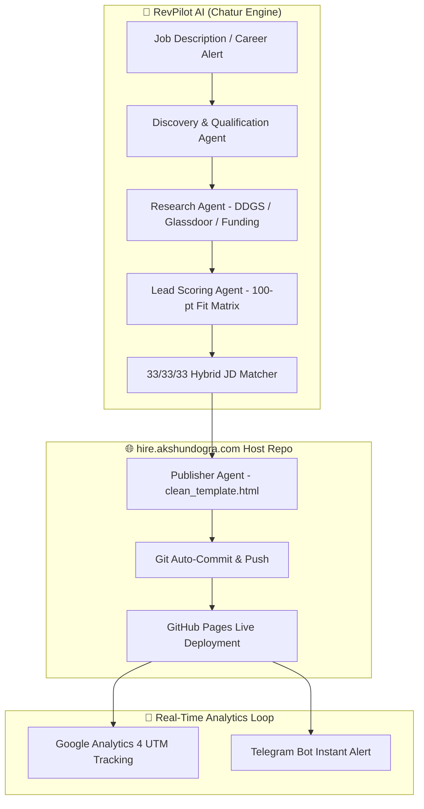
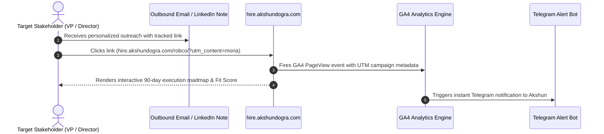

# 🚀 hire.akshundogra.com — Autonomous GTM Proposal Host & ABM Engine

[-blueviolet?style=for-the-badge)](https://github.com/akshundogra/Chatur)

**`hire.akshundogra.com`** is the high-conversion live deployment target for **RevPilot AI** ([Chatur](https://github.com/akshundogra/Chatur)), an autonomous Account-Based Marketing (ABM) and GTM Engineering platform built by **Akshun Dogra**.

Instead of submitting static PDF resumes to traditional Applicant Tracking Systems (ATS), this platform dynamically generates custom, signal-matched 90-day execution roadmaps and interactive proposal pages for target B2B SaaS and Robotics companies.

---

## 🔄 Platform Evolution: Legacy vs. Autonomous Engine

| Feature | Legacy Phase (Manual Portfolio) | Current Phase (RevPilot AI Engine) |
| :--- | :--- | :--- |
| **Generation Model** | Manual static HTML coding per company | 🤖 Fully Autonomous ABM Pipeline (`generate_page.py`) |
| **Research & Intelligence** | Manual job description analysis | 🔍 Automated DuckDuckGo, Glassdoor, & Funding signal extraction |
| **Personalization** | Generic experience bullet points | 🎯 33/33/33 Hybrid JD-Resume skill matching & custom 90-day roadmaps |
| **Delivery & Routing** | Flat page directory | ⚡ Automatic GitHub Pages deployment & clean URL routing (`/robco`, `/alasco`) |
| **Lead Tracking** | None | 📊 GA4 UTM campaign parameters & instant Telegram alert triggers |

---

## 🏗️ System Architecture & Workflow

### 1. End-to-End ABM Pipeline Architecture (UML Component Diagram)

---

### 2. Live Proposal Delivery Sequence (UML Sequence Diagram)

---

## 📂 Hosted Proposal Index

Below are active company-specific ABM landing pages hosted on this repository:

| Company | Open Position | Target Route | Status |
| :--- | :--- | :--- | :--- |
| **RobCo** | Marketing Operations Specialist | [`hire.akshundogra.com/robco/`](https://hire.akshundogra.com/robco/) | 🟢 Live (Fit: 100/100) |
| **Eye-Able** | GTM & Growth Lead | [`hire.akshundogra.com/eye-able/`](https://hire.akshundogra.com/eye-able/) | 🟢 Live |
| **Alasco** | Revenue Operations & Growth Manager | [`hire.akshundogra.com/alasco/`](https://hire.akshundogra.com/alasco/) | 🟢 Live |
| **Celonis** | Enterprise Growth Specialist | [`hire.akshundogra.com/celonis/`](https://hire.akshundogra.com/celonis/) | 🟢 Live |
| **Vercel** | Developer Experience / GTM Lead | [`hire.akshundogra.com/vercel/`](https://hire.akshundogra.com/vercel/) | 🟢 Live |
| **PostHog** | Growth & Analytics Engineer | [`hire.akshundogra.com/posthog/`](https://hire.akshundogra.com/posthog/) | 🟢 Live |

---

## 🛠️ Stack & Infrastructure

- **Hosting & Deployment**: GitHub Pages + Custom Domain (`hire.akshundogra.com`) + Vercel routing
- **Generator Engine**: Python 3.11 + FastAPI + Jinja2 + Playwright (`Chatur`)
- **Tracking & Attribution**: Google Analytics 4 (UTM parameter parsing) + Telegram Bot API
- **Design System**: Glassmorphism dark mode, Inter/Outfit typography, responsive HSL color system

---

> [!NOTE]
> All company landing pages hosted on this domain are generated automatically by the [RevPilot AI Engine](https://github.com/akshundogra/Chatur) as part of targeted B2B outreach campaigns.
